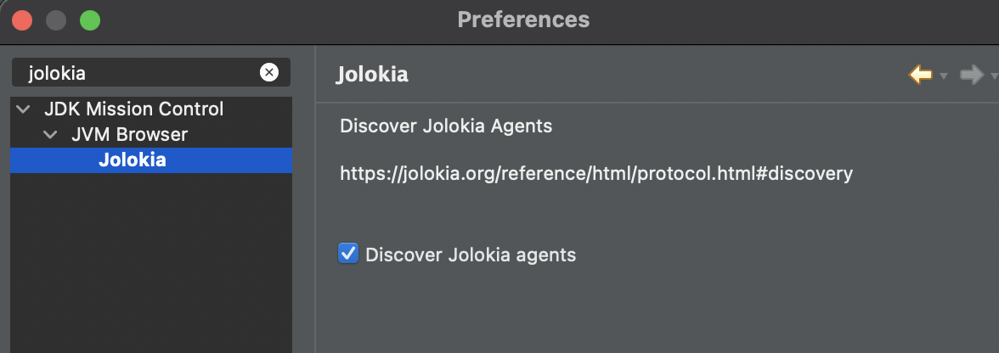
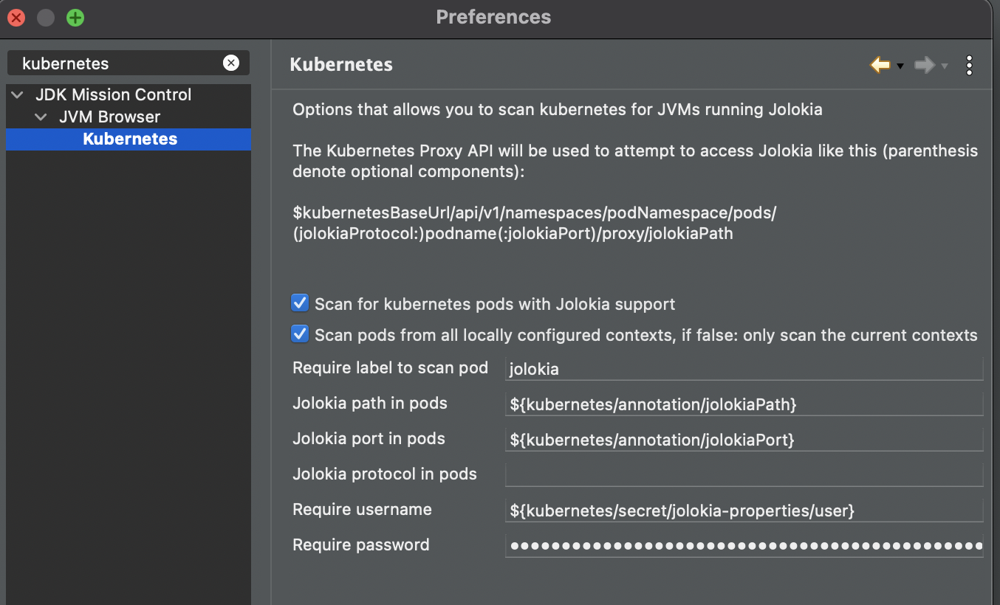
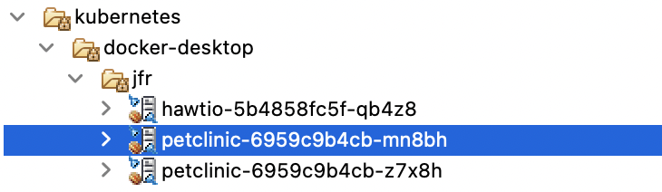

# Jolokia plugins for Java Mission Control

## Objective
Allow Java Mission Control to connect to [Jolokia](https://jolokia.org) enabled JVMs over the network or in [kubernetes](https://kubernetes.io)

## Installing
1. If you have not already, download [eclipse IDE](https://www.eclipse.org/downloads/)
2. Install Java Mission Control 8.1 or newer from update site : https://github.com/AdoptOpenJDK/openjdk-jmc-overrides/releases/download/8.1.0/org.openjdk.jmc.updatesite.ide-8.1.0.zip
   - Download
   - Help \ Install New Software ... \ Add ... \ Archive ... \ Select the downloaded file
   - Select Java Mission Control and any other features you want
3. Add Jolokia JMC plugins from the plugin site: https://skarsaune.github.io/jolokia-jmc-update-site
   - If Jolokia and Kubernetes features do not show up, deselect "Group items by category"
   - Install Jolokia and Kubernetes plugins
   
[video of installation](https://youtu.be/k0f_xVe-XLY)

## Connecting to JVMs
### To connect directly to JVMs with Jolokia over a regular network connection:
   - Open the JVM Browser view
   - New Connection
   - Select Custom JMX service URL
   - Enter `service:jmx:jolokia://host:port/path/`
### To connect to a JVM with Jolokia running in kubernetes
   - Open the JVM Browser view
   - New Connection
   - Select Custom JMX service URL
   - Enter `service:jmx:kubernetes:///kubnernetes-namespace/(http/https:)podname(:portnumber)/path-to-jolokia/`
Entries in parenthesis are optional.
   - http is default protocol
   - if the pod has only one port that will be used if portnumber is omitted
   - Regular expression may be used as part of podname, if you are happy to connect to any pod matching a given pattern.
This can be useful if you want to store a connection string that will work even after redeploys. Example:
   - `service:jmx:kubernetes:///jfr/petclinic-.+:8778/jolokia/`

### To use [Jolokia Discovery](https://jolokia.org/reference/html/protocol.html#discovery) to detect JVMs running with Jolokia

Under JDK Mission Control \ JVM Browser \ Jolokia , check "Discover Jolokia Agents".
A process will run in the background and update the list of JVMs every 30 seconds

### To scan kubernetes for JVMs

Under JDK Mission Control \ JVM Browser \ Kubernetes , check "Scan for kubernetes pods with Jolokia support".
A process will run in the background and update the list of JVMs every 30 seconds

 
 
  - Scan pods from all locally configured contexts: If you have configured several context in your kubernetes config, it will iterate over all the contexts and scan for pods in each of them. If not checked only the currently configured context will be scanned
  - Jolokia path in pods : Either hardcode if the path is consistent in all pods. Alternatively you may allow the individual pods to declare with an attribute what path to use by a special syntax:  example `${kubernetes/annotation/jolokiaPath}` 
  - Jolokia port in pods : Hardcode to a numeric value if it is consistent across all pods. Alternatively delegate to a pod attribute with the same syntax as for jolokia path. Example: `${kubernetes/annotation/jolokiaPort}`
  - Jolokia protocol in pods : http or https, leave blank to default to http. Can also be delegated to pod attribute
  - Require username / password : Leave blank for no authentication. Can be hardcoded if it is consistent over pods. It is also possible to refer to a kubernetes secret in the same namespace as the pod. The secrect can either be a basic auth secret or an opaque secret that contains a java.util.Properties file contents. The username and password must then refer to items within that secret. Examples: `${kubernetes/secret/jolokia-properties/user}` and `${kubernetes/secret/jolokia-properties/password}`

Any pods that are successfully probed will show up in the JVM Browser hierarchy under kubernetes/context/namespace :  

Example snippet of a helm chart of a deployment that declares properties suitable for scanning from JMC: 

    kind: Deployment
    apiVersion: apps/v1
    metadata:
      name: petclinic
      namespace: jfr
      labels:
        jolokia: 'true'
        k8s-app: petclinic
      annotations:
        deployment.kubernetes.io/revision: '3'
    spec:
      replicas: 2
      selector:
        matchLabels:
          k8s-app: petclinic
      template:
        metadata:
          name: petclinic
          annotations:
            jolokiaPath: 'jolokia/'
            jolokiaPort: '8778'
          labels:
            k8s-app: petclinic
            jolokia: 'true'
        spec:
          volumes:
          - name: jolokia-properties
            secret:
              secretName: jolokia-properties
          containers:
            - name: petclinic
              image: kantega.azurecr.io/petclinic:latest
              ports:
              - name: http
                containerPort: 8080
                protocol: TCP
              - name: jolokia
                containerPort: 8778
                protocol: TCP
              volumeMounts:
              - name: jolokia-properties
                readOnly: true
                mountPath: "/etc/jolokia"
              env:
                - name: JAVA_TOOL_OPTIONS
                  value: "-javaagent:/jolokia-jvm-agent.jar=config=/etc/jolokia/jolokia.properties "

## To develop or troubleshoot the Jolokia or Kubernetes plugins
1. Clone jmc `git clone git@github.com:openjdk/jmc.git`
2. Follow instructions to build
3. Open the projects in an Eclipse workspace
4. Clone this repo or a fork of it
5. Run `mvn dependency:copy-dependencies` in subfolders `org.openjdk.jmc.jolokia` and `org.openjdk.jmc.kubernetes`
4. Open the projects in the same workspace as where you have the jmc projects
5. Debug JMC or Eclipse with JMC with one of the Jolokia or Kubernetes launchers
6. Feel free to register issues with suggestions or problems in this repo

#Visual VM plugin

1. Download plugin https://skarsaune.github.io/jolokia-jmc-update-site/visualvm/org-jolokia-jmx-plugin.nbm
2. Add downloaded plugin and choose install 

